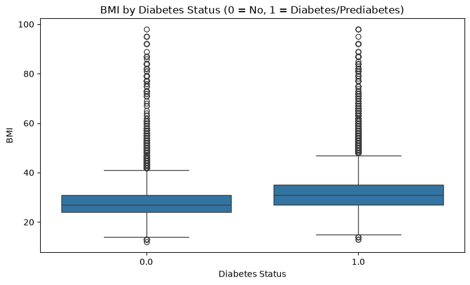
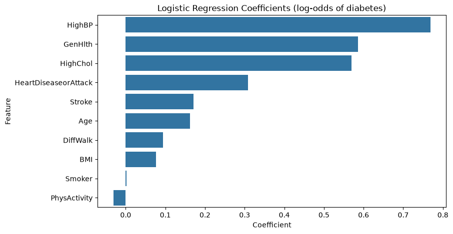

# Project Documentation

This site provides project documentation.
Use the documentation navigation to explore.

## How-To Guide

Many instructions are common to all our projects.

See
[⭐ **Workflow: Apply Example**](https://denisecase.github.io/pro-analytics-02/workflow-b-apply-example-project/)
to get the example projects running on your machine.

## Project Documentation Pages (docs/)

- **Home** - this documentation landing page
- [**Project Instructions**](./project-instructions.md)  - the standard project workflow
- [**Your Files**](./your-files.md) - how to copy the example and create your version
- [**Glossary**](./glossary.md) - project terms and concepts
- [**API**](./api.md) - autogenerated code documentation for the public project interface

---

## Phase 4. Technical Modification

**What I changed.** I copied the working example
(`src/mlstudio/app_case.py`) to my own file
(`src/mlstudio/app_venkat_teja.py`) and made one small change:
the model evaluation now also reports the
**Root Mean Squared Error (RMSE)** alongside MAE and R-squared,
using `sklearn.metrics.root_mean_squared_error`.

**Why I chose it.** RMSE is in the same units as the target
(score points), but unlike MAE it squares each error before
averaging, so it penalizes large misses more heavily.
Comparing RMSE to MAE tells you something MAE alone cannot:
if RMSE is much larger than MAE, a few predictions are far off;
if they are close, the errors are fairly uniform.

**How I verified it.** I ran my copy from the project root:

```shell
uv run python -m mlstudio.app_venkat_teja
```

The example (`app_case`) still runs unchanged, so the project
keeps working with both versions side by side.

**What confirmed the change.** The log output now shows the new
metric between the two original ones:

```text
| INFO | ML | Mean absolute error: 0.48
| INFO | ML | Root mean squared error: 0.53
| INFO | ML | R-squared: 1.00
```

RMSE (0.53) is close to MAE (0.48), which means the model's
errors on the test set are small and uniform - no single
prediction misses by a lot.

**Difficulty.** The change itself was easy - one import and two
lines. The useful part was reading the example closely enough to
know exactly where evaluation happens (`train_model`) and keeping
the change small enough to explain every line.

## Phase 5. Custom Project

My custom project predicts diabetes status from health survey
answers, implemented in `src/mlstudio/app_diabetes_venkat_teja.py`
and run with:

```shell
uv run python -m mlstudio.app_diabetes_venkat_teja
```

### Basis and Data

The example project (`app_case.py`) predicted a student's exam
score from study habits using a tiny 10-row synthetic dataset.
I kept that example working and applied its workflow to the
**CDC Diabetes Health Indicators** dataset (`data/raw/diabetes.csv`),
the recommended custom dataset already included in this repo.

- **Source:** Derived from the CDC Behavioral Risk Factor
  Surveillance System (BRFSS) 2015 survey; full citation in
  `data/raw/README.md`.
- **Size:** 70,692 survey respondents, 22 columns, balanced
  50/50 between the two target classes (35,346 each).
- **Why I chose it:** It is a real public-health dataset, large
  enough that a train/test split is meaningful (a 20% test set
  still holds back about 14,000 records), and it poses a
  different problem type than the example.
- **Limitations and assumptions:** Answers are self-reported
  survey responses; many columns are binned (Age is a 13-level
  group code, not years). The 50/50 balance was created by
  sampling, so real-world prevalence is much lower - accuracy
  here does not transfer directly to the general population.
  About 1,635 duplicate rows exist, which is plausible when
  every column is a rounded or yes/no answer, so they were kept.

### Modeling Approach

This is **supervised learning**: I picked a target column to
predict, `Diabetes_binary` (0 = no diabetes, 1 = diabetes or
prediabetes), and trained on labeled examples.

The target is a **discrete category**, not a continuous number,
so this is a **classification** problem - unlike the example,
which predicted a continuous score (regression). I used
`LogisticRegression` with 10 interpretable features (blood
pressure, cholesterol, BMI, smoking, stroke, heart disease,
physical activity, general health, difficulty walking, age
group) and evaluated with accuracy and a confusion matrix
instead of MAE and R-squared.

### Summary

I copied the example's nine-section workflow (load, inspect,
check quality, clean, train, predict one case, chart, summarize)
and swapped in the new dataset, target, model, and metrics.
Charts are saved to `artifacts/` so results are reviewable
without re-running.

**Results** on the 20% held-out test set (about 14,139 rows):

- **Accuracy: 0.745** - meaningfully better than the 0.50 a
  coin flip would score on this balanced dataset.
- Confusion matrix: 5,132 true negatives, 5,396 true positives,
  1,958 false positives, 1,653 false negatives.
- A hypothetical respondent with high blood pressure, high
  cholesterol, BMI 33, fair general health, and age 60-64 was
  predicted diabetic with probability 0.82.

The BMI distribution shifts visibly upward for the diabetes
group:



The model coefficients rank high blood pressure, poor general
health, and high cholesterol as the strongest risk indicators,
with physical activity the only protective (negative) feature:



**What I learned:** how to characterize a problem before
modeling (binary category target means classification), why the
baseline matters when judging accuracy, and how coefficient
signs turn a model into an explanation. The same workflow -
frame the target, split the data, fit, evaluate against a
baseline, interpret - applies to real problems like predicting
customer churn, loan default, or hospital readmission.
